# Your Project Title Here

In this project with are provided with a dataset: the Bank marketing dataset. We seek to predict whether or not clients of a bank will subscribe to a product being advertised. In order to achieve our goal we use AzureML, we run a classification automated ML with ``y`` being our label column name. We get the best performing model from our run and deploy so that we can easily consume (or predict for new data) by just making an API call whenever we want. We also deploy the pipeline configure for running our automl, so that we can easily trigger a run by simply making an API call

## Architectural Diagram
Here is an architectural diagram of our project.
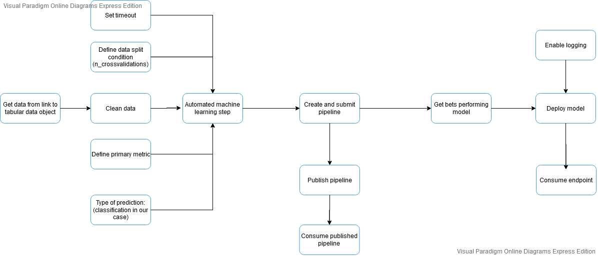

## Key Steps
We ran our project in the lab, so we could start by creating a service principal. We went ahead and just code and ran our pipelines.

### Getting the data
We first start by getting our data and storing it.
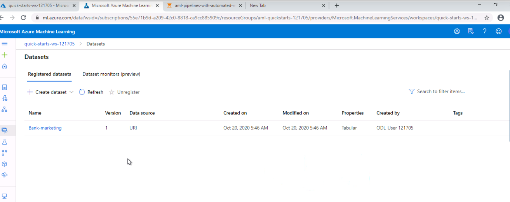
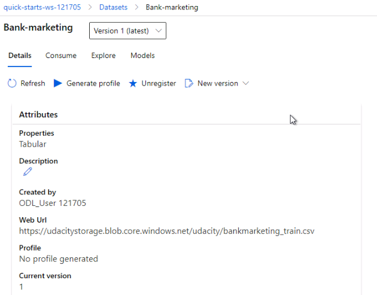

### Configuring and running our Automl Pipeline
We appropriately configure our pipeline. We create an automl step and pass it to our pipeline, then we submit our pipeline so that it is ran. 

Here are some details about our pipeline run
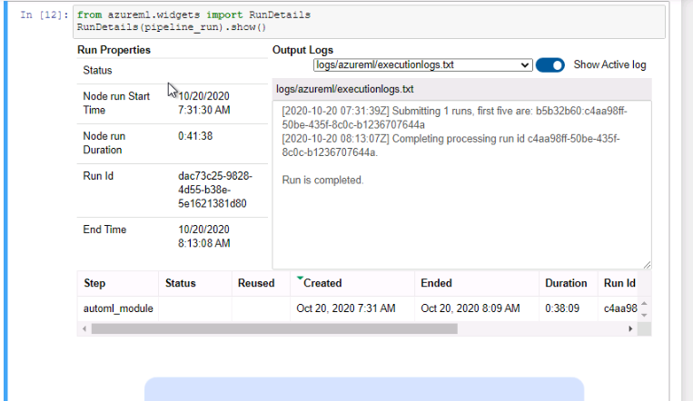
Here we can see that our pipeline run is complete:
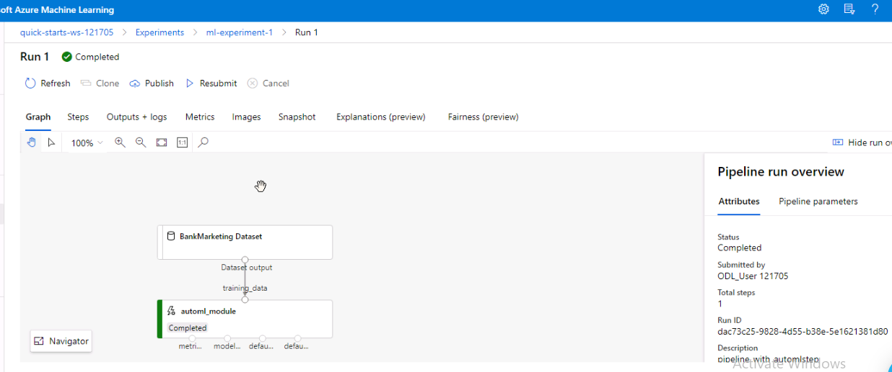
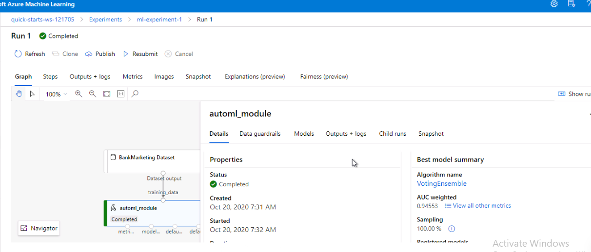

### Best performing model
We pick the best performing model from our automl pipeline run.

Here we can see the best model
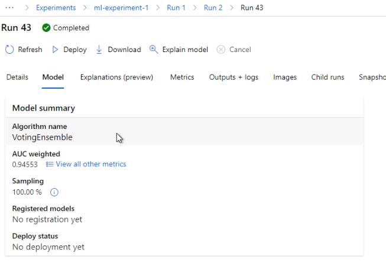

Here are some metrics about the model
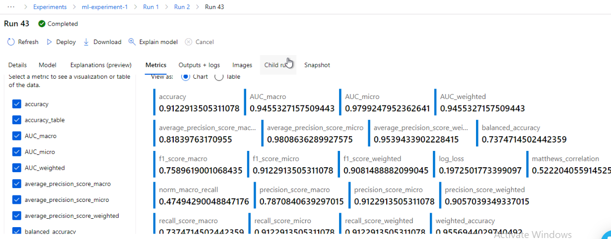

### Deploying the best performing model

We deploy the best performing model, using ACI (``Azure container instance``) and we enable security.
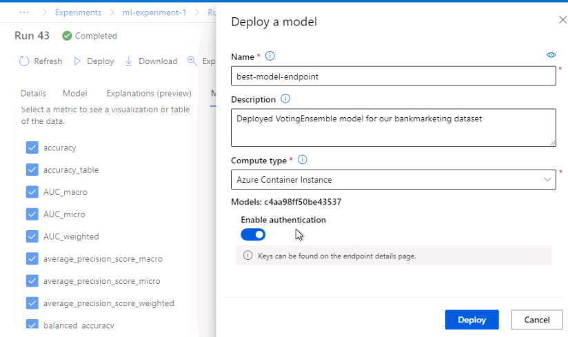
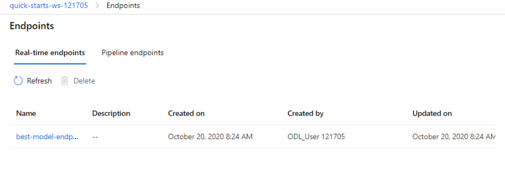
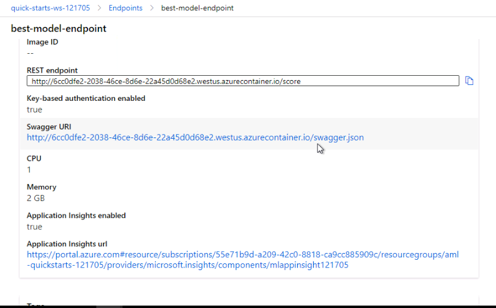

### Enable logging. 

We enable logging for our deployed model endpoint. 
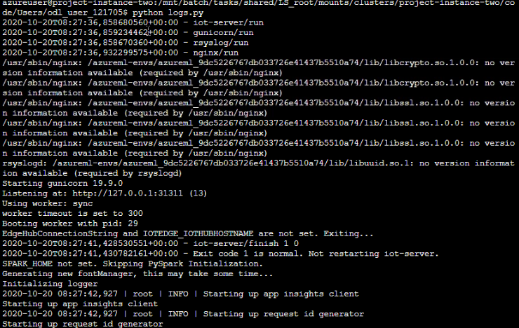
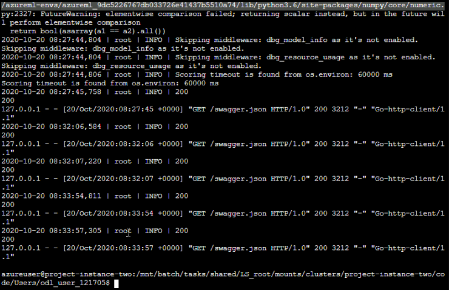

### Read endpoint document. 
We get the ``swagger.json`` file from our endpoint details. We use this file to generate documentation on our to consume our endpoints with ``swagger``.

Getting swagger.json
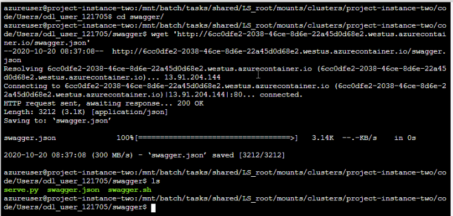

### Consume our endpoint
We consume our endpoint. We use our endpoint to do some predictions given some data

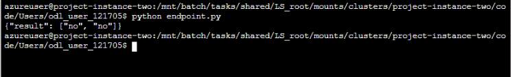

### Publish pipeline
We publish our pipeline
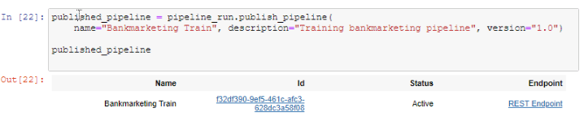

Here is our published pipeline
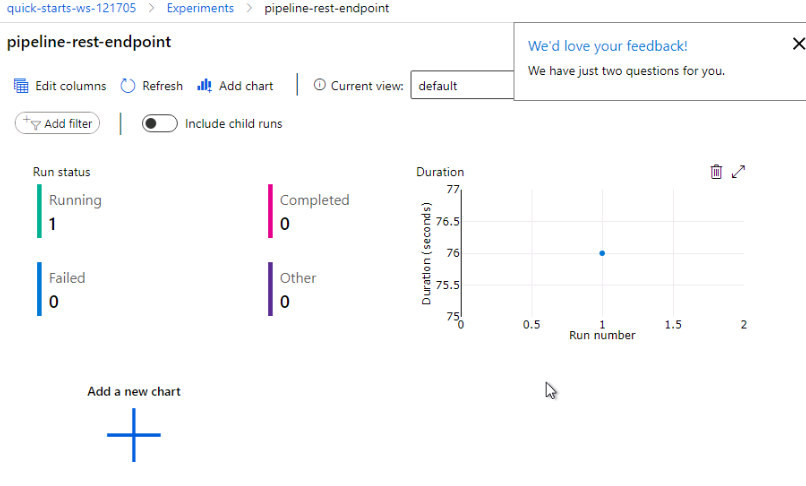
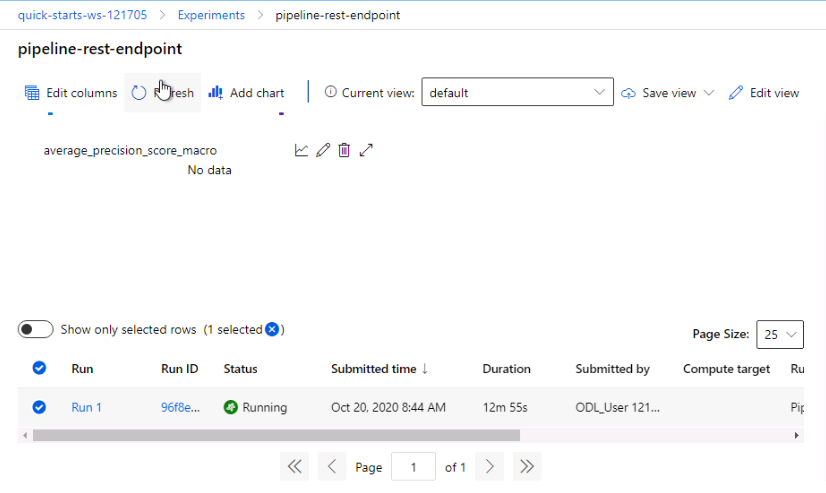
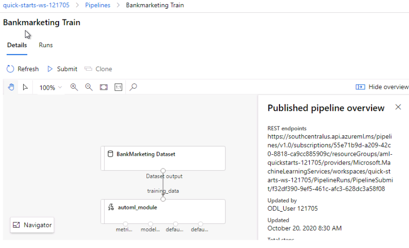
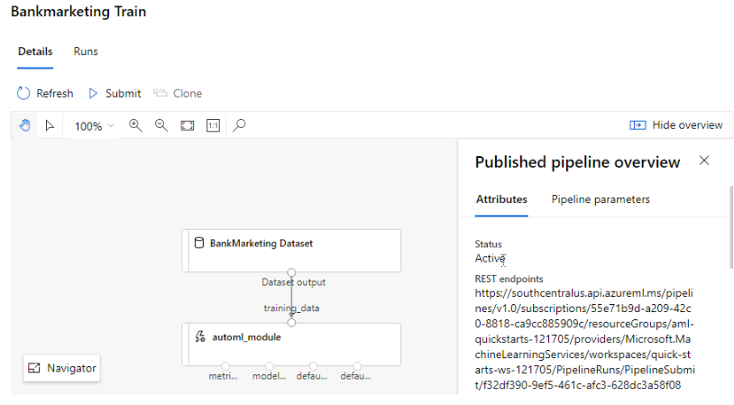

### Consume our published pipeline

We consume our published pipeline:
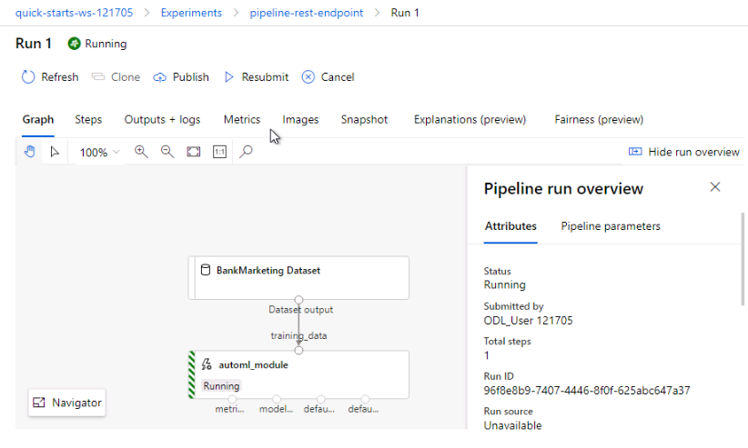
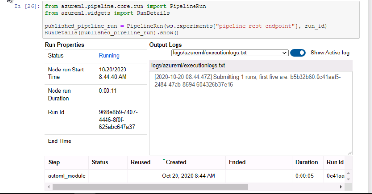

## Screen Recording
We have successfully recorded a screen showing how this project works. The video can be found at this [link](https://youtu.be/KNpKExpGcD0)

## Standout Suggestions
*TODO (Optional):* This is where you can provide information about any standout suggestions that you have attempted.

## Future improvement

There are few things we would like to do to improve on this project.
- First we will later on add a parralel step to our pipeline. The goal is that we want to better use our ressource to effeciently get results went we have a lot of data to work with.
- We will do some future engineering on the data. The data is very imbalanced, with a lot of outliers, thus dropping the accuracy of our model. We will remove the outliers, to improve accuracy.
